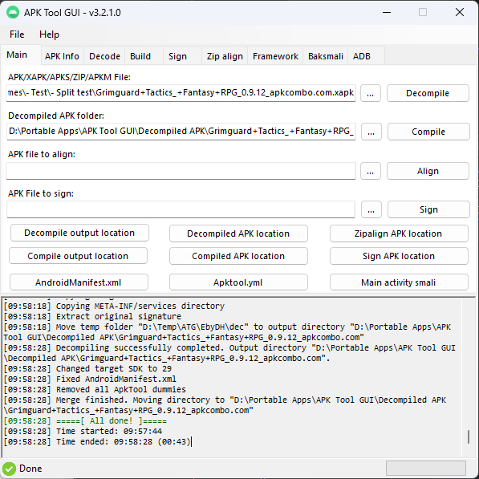

# APK Tool GUI

 

GUI for apktool, signapk, zipalign and baksmali utilities.

It is a tool for reverse engineering 3rd party, closed, binary Android apps. It can decode resources to nearly original form and rebuild them after making some modifications; it makes possible to debug smali code step by step. Also it makes working with app easier because of project-like files structure and automation of some repetitive tasks like building apk, etc.

# Download links
https://github.com/AndnixSH/APKToolGUI/releases

Any such report from your antivirus is a false positive and is due to how the application works. You must manually add APKToolGUI.exe to your antivirus's whitelist/exclusion list.

If you don't believe this then try to compile the app by yourself or simply don't use it until you can confirm it is safe by working directly with your antiirus provider.

# Requirements
- Windows 7 32-bit/64-bit and above
- [Java](https://www.java.com/en/) or [JDK](https://www.oracle.com/java/technologies/downloads/) 8 or above. Using latest JDK is not really necessary, it tends to cause unexpected issues. Java 8 and 17 (long-term support release) is enough. Use 64-bit version if your system is 64-bit
- [.NET Framework 4.8](https://dotnet.microsoft.com/en-us/download/dotnet-framework/net48) (Windows 8 and above already have it preinstalled)

# Features
- Decompile APK
- Decompile and merge split APK/XAPK/APKS/ZIP/APKM using build-in split merging or APKEditor.jar (Default)
- Compile APK
- Sign APK
- Zipalign APK
- Adb
- Framework
- Drag and drop
- APK info
- Log output
- All features from [Apktool](https://ibotpeaches.github.io/Apktool/documentation/).
- Additional features that can fix some Apktool errors, such as removing DUMMY_APKTOOL, clear framework before decompiling
- Multi language
- Right-click context menu
- Create unsigned APK for Core Patch
- High DPI support
- Long path support (Windows 10 and above) 

# Languages
- Brazilian Portuguese (Incomplete)
- English
- Hungary (Incomplete)
- Russian (Incomplete)
- Chinese Simplified (Incomplete)

### Translation
If you like to help translate with your native language, I recommend using Visual Studio 2022. You don't need any programming knowledge, you just edit the GUI and the `.resx` files

Create new `.resx` file under `Languages` folder, and `Forms/FormXXX.cs/`. To create a new `.resx` under `Forms/FormXXX.cs/`, open the form and select the form to show the properties. In the properties, scroll down until you see Language, and select any language you would like to translate.

Video tutorial

https://user-images.githubusercontent.com/40742924/227244601-6f796141-ac2d-4c60-b5cd-7f6872604cd7.mp4
  

If you can't use Visual Studio, you can use translator tools like [resxtranslator](https://github.com/HakanL/resxtranslator) or [RESX Translator automat](https://www.utilstudio.com/en/resx-translator/), but make sure the `.resx` file is added to [APKToolGUI.csproj](https://github.com/AndnixSH/APKToolGUI/blob/master/APKToolGUI/APKToolGUI.csproj), otherwise Visual Studio would not be able to detect it

Make pull request when you are done

# Issues
Issues with Apktool? Please do cursory search of the issue tracker of [Apktool](https://github.com/iBotPeaches/Apktool/issues?q=is%3Aissue) and [Baksmali](https://github.com/JesusFreke/smali/issues?q=is%3Aissue), see if your question may be answered

For Framework/system apps related issues, check on [XDA Forum](https://forum.xda-developers.com/)

**Some apps may been protected or obfuscated for content protection purposes or against cheaters. Bypassing of such is beyond the scope of this tool, so please DO NOT post an issue regarding to it. This tool does not support bypassing such protections, and never will be!**

Anything else, [create a new issue](https://github.com/AndnixSH/APKToolGUI/issues)

# FAQ
##### Q: Can it be ported to other OS like Linux?
A: Notthing is impossible, but it's not easy as long as Microsoft not supporting WinForm for other platforms, making .NET Core useless, unlike Java FX that supports other platforms since decades. If you know, feel free to open an issue. Until then, use [WineHQ](https://www.winehq.org/) or similar to run exe

##### Q: How to update Apktool?
A: Download [Apktool.jar](https://github.com/iBotPeaches/Apktool/releases) and replace it on Resources folder

##### Q: How to update Baksmali/Smali?
A: Download [Baksmali.jar/Smali.jar](https://bitbucket.org/JesusFreke/smali/downloads/) and replace it on Resources folder

##### Q: How to reset?
A: Simply delete the config.xml file from the directory of the executeable

##### Q: Can you make an automatic APK injecting tool?
A: No, I'm not interested.

##### Q: Can you implement to convert APK to AAB?
A: No, apktool is about recompiling, not converting to other formats. AAB is only used for distributing an application to Play Store, so it is not directly installable. If you really want to convert APK to ABB, try APK2AAB tool https://github.com/sensei-z/APK2AAB

##### Q: I don't like split APK. Where can I get single APK instead?
A: Download from [Apkcombo's APK downloader](https://apkcombo.com/downloader/), or [Apkpure](https://apkpure.com/) (Choose APK instead XAPK)

##### Q: Can you help me with modding APK in general?
A: Sorry, I don't offer support with it.

##### Q: Can you implement features to protect/pack/obfuscate APK?
A: No, APK protection is beyond the scope of this tool

##### Q: Can you implement features to deobfuscate/unpack APK or bypass anti-cheat/security?
A: No, they are also beyond the scope of this tool. I don't condone bypassing such protections

# Development
This project is written in C#

Use Visual Studio 2019 and above. NET Framework 4.8 SDK is required

# Credits
- AndnixSH
- INF1NUM (Original author of [APKToolGUI](https://github.com/INF1NUM/APKToolGUI))
- iBotPeaches ([Apktool CLI](https://ibotpeaches.github.io/Apktool/))
- REAndroid ([APKEditor](https://github.com/REAndroid/APKEditor))
- shadow578 ([ApksMerger](https://github.com/shadow578/ApksMerger))

# Disclaimer
Same as Apktool by iBotPeaches, It is NOT intended for piracy and other non-legal uses. It could be used for localizing, adding some features or support for custom platforms and other GOOD purposes. Just try to be fair with authors of an app, that you use and probably like.

# License
The original repo does not have a license but I have permission from the author to use ane distriute this project as open source, without license. He doesn't seems to know much about licensing. For this project, I'll just add license as unlicensed
