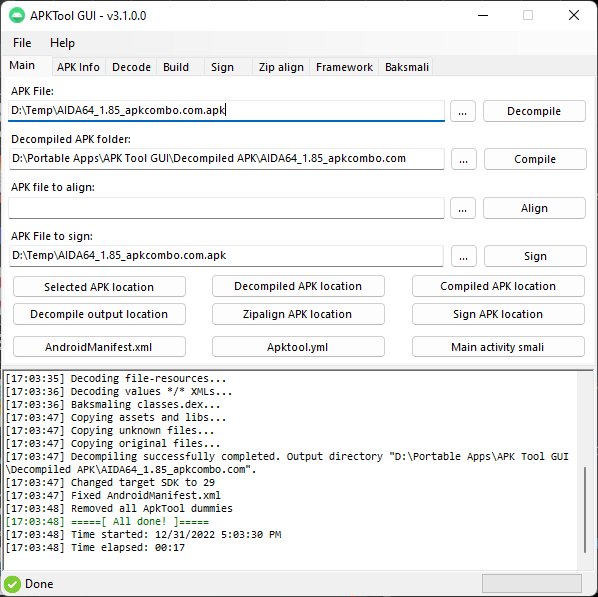

# APK Tool GUI

 

GUI for apktool, signapk, zipalign and baksmali utilities.

It is a tool for reverse engineering 3rd party, closed, binary Android apps. It can decode resources to nearly original form and rebuild them after making some modifications; it makes possible to debug smali code step by step. Also it makes working with app easier because of project-like files structure and automation of some repetitive tasks like building apk, etc.

# Download links
https://github.com/AndnixSH/APKToolGUI/releases

# Requirements
- Windows 7 32-bit/64-bit and above
- JDK/JRE 8 and above. Highly recommended to use 64-bit version of Java if your system is 64-bit
- .NET Framework 4.8

# Features
- Decompile APK
- Compile APK
- Sign APK
- Zipalign APK
- Framework
- Drag and drop
- APK info
- Log output
- All features from [Apktool](https://ibotpeaches.github.io/Apktool/documentation/).
- Additional features that can fix some Apktool errors, such as removing DUMMY_APKTOOL, clear framework before decompiling
- Multi language
- Right-click context menu

# Languages
- Brazilian Portuguese (Incomplete)
- English
- Hungary (Incomplete)
- Russian (Incomplete)
- Chinese Simplified (Incomplete)

### Translation
If you like to help translate with your native language, use Visual Studio 2022

- Create new resx file under Languages folder within Visual Studio.

- Open any forms. Under properties, scroll down until you see Language, and select any language you would like to translate. It will create new resx file inside cs file

If you can't use Visual Studio, you can use translator tools like [resxtranslator](https://github.com/HakanL/resxtranslator) or [RESX Translator automat](https://www.utilstudio.com/en/resx-translator/), but make sure the .resx file is added to [APKToolGUI.csproj](https://github.com/AndnixSH/APKToolGUI/blob/master/APKToolGUI/APKToolGUI.csproj), otherwise Visual Studio would not compile it

Make pull request when you are done

# Issues
Issues with Apktool? read the log, check if your modification and/or syntax is correct.

Framework/system apps related issues, check on [XDA Forum](https://forum.xda-developers.com/)

**Some apps may been protected or obfuscated for content protection purposes or against cheaters. Bypassing of such is beyond the scope of this tool, so please DO NOT post an issue regarding to it. This tool does not support bypassing such protections, and never will be!**

Anything else, report here https://github.com/AndnixSH/APKToolGUI/issues

# FAQ
##### Q: Can it be ported to other OS like Linux?
A: Maybe, but it's not easy since Microsoft is dumb for not supporting it for .NET Core, unlike Java FX which supported all platforms. If you know, feel free to open an issue

##### Q: How to update Apktool?
A: Download [Apktool.jar](https://github.com/iBotPeaches/Apktool/releases) and replace it on Resources folder

##### Q: How to update Baksmali/Smali?
A: Download [Baksmali.jar/Smali.jar](https://bitbucket.org/JesusFreke/smali/downloads/) and replace it on Resources folder

##### Q: How to reset?
A: Simply delete the config.xml file on the same directory of the executeable

##### Q: Why this tool is a virus?
A: It just a false positive, anti-virus always flag tools/softwares like this as virus. Don't always believe what your anti-virus are telling you. Try to compile the source by yourself and you will see

##### Q: Can you make an automatic APK injecting tool?
A: No, that's not the scope of this tool, and I don't have time for that. However, you can try making it by yourself, or have a look on [SaveToGame](https://github.com/And42/SaveToGame) project which can give you ideas how to do it.

##### Q: Can you implement an option to protect/pack/obfuscate APK?
A: No, protection is beyond the scope of this tool

##### Q: Can you implement an option to deobfuscate/unpack APK or bypass anti-cheat/security?
A: No, they are also beyond the scope of this tool. I don't condone bypassing such protections

# Development
This project is written in C#

Use Visual Studio 2019 and above. NET Framework 4.8 SDK is required

# Credits
- AndnixSH
- iBotPeaches ([Apktool CLI](https://ibotpeaches.github.io/Apktool/))
- INF1NUM (Original author of [APKToolGUI](https://github.com/INF1NUM/APKToolGUI))

# Disclaimer
Same as Apktool by iBotPeaches, It is NOT intended for piracy and other non-legal uses. It could be used for localizing, adding some features or support for custom platforms and other GOOD purposes. Just try to be fair with authors of an app, that you use and probably like.
